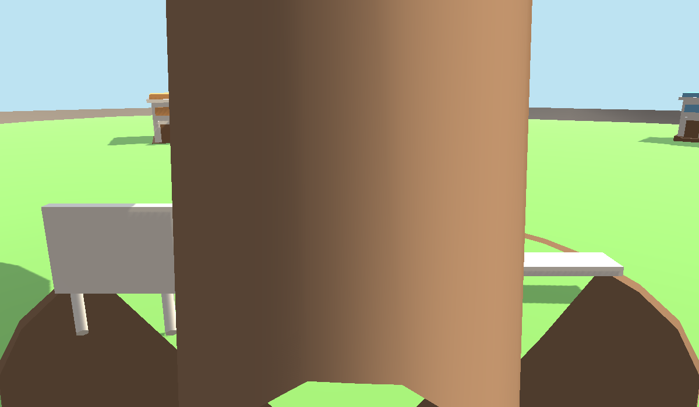
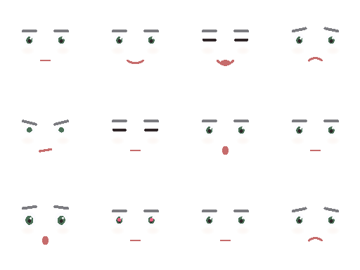
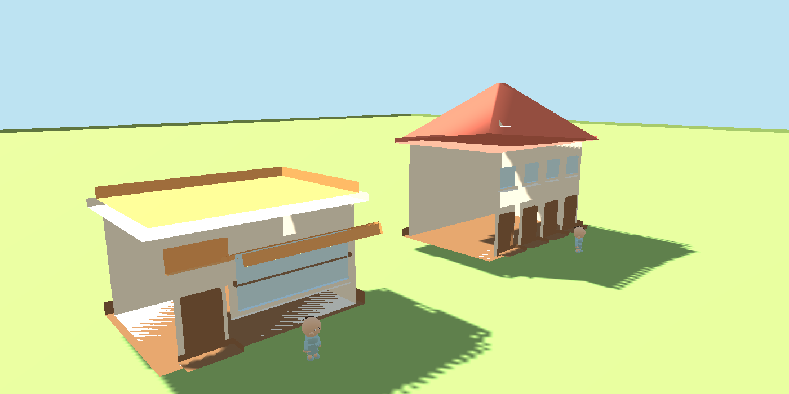
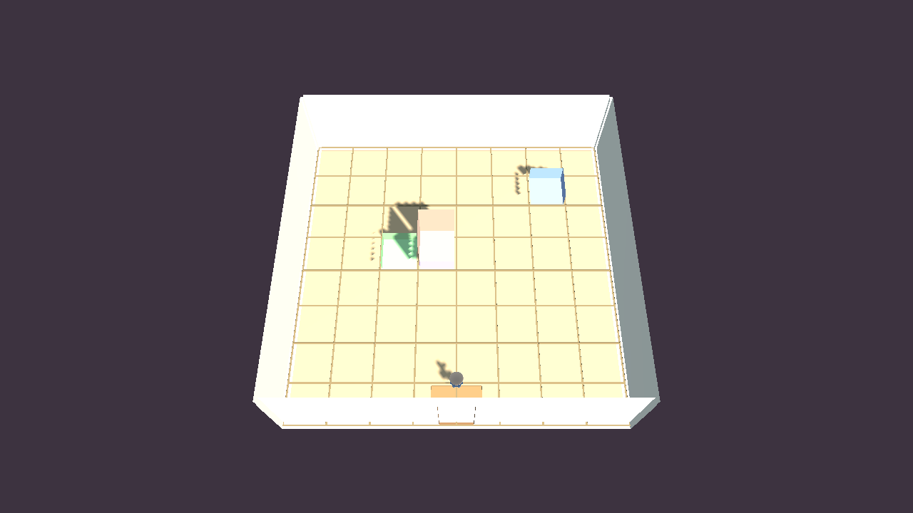

# Isla Nimbo

Un **Rune Factory en el cielo**: una granja, un oficio y una vida en una aldea de islas
flotantes cuyos habitantes se hacen amigos, se enamoran y se casan entre ellos sin que tú
intervengas — y a la que acabas gobernando.

Unity 6000.5.5f1 · URP · C#



---

## No hay un solo archivo de arte en este repositorio

Ni un `.png`, ni un `.fbx`, ni un `.blend`, ni un `.wav`. **Todo lo que se ve y se oye se
construye por código en tiempo de ejecución.**

| Qué | Dónde |
|---|---|
| Islas y terreno | `Art/World/IslandMeshBuilder.cs` |
| Edificios | `Art/World/BuildingMeshBuilder.cs` |
| Vegetación y rocas | `Art/World/FoliageMeshBuilder.cs` · `RockMeshBuilder.cs` |
| Decoración | `Art/World/DecorMeshBuilder.cs` |
| Personajes chibi | `Art/Chibi/ChibiMeshBuilder.cs` · `MeshShapes.cs` |
| Caras | `Art/Chibi/ChibiFaceTexture.cs` — texturas generadas, no dibujadas |
| Voces | `Art/Audio/VoiceSynth.cs` — síntesis, no muestras grabadas |
| Sonido y música | `Art/Audio/SoundBank.cs` · `AudioDirector.cs` |

La geometría tiene sus propias pruebas (`MeshShapeTests.cs`), igual que el audio
(`AudioTests.cs`). El arte aquí es código, y se trata como código.

> **Esto es un andamio, no el destino.** El arte generado —y buena parte de lo que
> sostiene— está pensado para ser reemplazado por trabajo manual. Sirve como base para
> ver qué necesita el juego de verdad antes de comprometerse con assets hechos a mano:
> qué siluetas funcionan, qué escala se lee bien, cuánta variación hace falta. Decidir
> eso con el juego en marcha sale mucho más barato que decidirlo modelando.
>
> Es también la razón de la frontera de `Nimbo.Art` que se describe más abajo: cuando
> llegue el arte manual, entra por el mismo sitio por donde hoy entra el generado.

<p>
  
  
</p>

---

## Qué es el juego

Tres pilares, en este orden de peso:

1. **Simulación de vida.** Los habitantes tienen voluntad propia. Sus romances, sus riñas
   y sus bodas ocurren **sin el jugador**, por personalidad y convivencia. Es lo que hace
   que la isla merezca la pena mirarla.
2. **Gestión de la aldea.** Asignas los trabajos, amplías las casas, organizas los eventos
   y atiendes lo que piden. No mandas sobre las personas: mandas sobre el escenario en el
   que viven, y ellas responden.
3. **Granja y oficio.** Huerto, recolección, herramientas, crafteo y venta. El protagonista
   tiene cuerpo, sube de nivel y desbloquea cosas al subir.

La fantasía es ser uno más de la aldea, no un dios.



---

## Arquitectura

El proyecto está partido en *assembly definitions* con dependencias en una sola dirección:

```
                        Nimbo.Data            tipos serializables, sin lógica
                             │
                        Nimbo.Core            EventBus, ServiceRegistry, reloj,
                             │                guardado, RNG
   ┌──────────┬──────────────┼──────────┬──────────┬──────────┐
Personality  Simulation   Social     Housing    Island    Economy
   └──────────┴──────────────┼──────────┴──────────┴──────────┘
                             │
                 Nimbo.UI         Nimbo.Art     malla procedural, materiales
                             │
                        Nimbo.Game            arranque, escenas, cableado
```

**`Nimbo.Art` no depende de ningún módulo de juego**: genera geometría y materiales a partir
de `Nimbo.Data`. Esa frontera es lo que permitió dejar el arte para el final sin bloquear
nada, y es la razón de que el juego sea jugable sin un solo asset importado.

Algunas convenciones que el código respeta sin excepción:

- El namespace es la ruta de la carpeta. Un tipo público por fichero.
- Nada de `static` mutable fuera de `Nimbo.Core`. Nada de singletons propios: `ServiceRegistry`.
- Nada de `GameObject.Find` ni `SendMessage`.
- `Resources.Load` solo al arrancar, y solo para los catálogos JSON de configuración.

Detalle completo en [`Docs/00_ARQUITECTURA.md`](Docs/00_ARQUITECTURA.md), que manda sobre
el resto de documentos.

---

## Cómo abrirlo

```bash
git clone https://github.com/bluelotus17113/NIMBO.git
```

Ábrelo con **Unity 6000.5.5f1** (la versión exacta está en `ProjectSettings/ProjectVersion.txt`).
Unity reconstruirá `Library/` en el primer arranque — tarda un rato y no está versionada, como debe ser.

Dependencias externas: Cinemachine 3.1.7 e Input System 1.20.0. Todo lo demás son módulos del propio motor.

Las pruebas se corren desde **Window → General → Test Runner**. Hay 211 archivos de prueba
entre EditMode y PlayMode.

---

## Documentación

| Documento | De qué trata |
|---|---|
| [`Docs/00_ARQUITECTURA.md`](Docs/00_ARQUITECTURA.md) | Capas, dependencias y convenciones. Manda sobre los demás |
| [`Docs/01_GDD.md`](Docs/01_GDD.md) | Documento de diseño |
| [`Docs/02_MECANICAS.md`](Docs/02_MECANICAS.md) | Mecánicas |
| [`Docs/03_PERSONALIDADES.md`](Docs/03_PERSONALIDADES.md) | Sistema de personalidades de los habitantes |
| [`Docs/04_ALDEA.md`](Docs/04_ALDEA.md) | La aldea y el giro de diseño de agosto |

---

## Estado

En desarrollo. El contenido de catálogo va por 80 muebles, 60 prendas y 44 recetas.

`Informes/` guarda las notas de trabajo y el estado entre sesiones — está en el repositorio
a propósito: es el cuaderno de bitácora del proyecto, no documentación pulida.

---

Hecho por [Isaac Levi Navas Oyola](https://github.com/bluelotus17113) ·
[portafolio](https://portafolio-megalitico.vercel.app)
